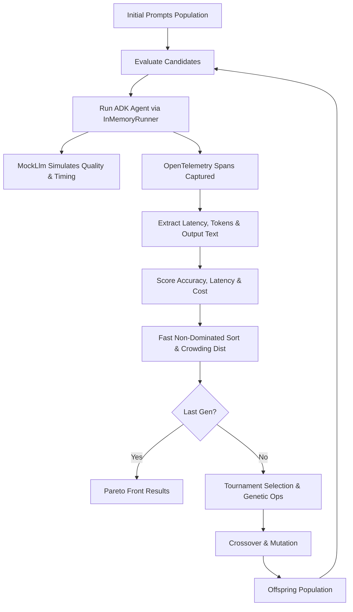

# GEPA Prompt Optimizer: Prototype Walkthrough

This walkthrough details the implementation, architecture, and verification results of the **Genetic Pareto (GEPA)** prompt optimization framework built using the **Google Antigravity SDK (ADK)** and its native **OpenTelemetry** telemetry/observability metrics.

---

## 1. Architectural Overview

The prototype follows a genetic optimization loop to find the Pareto Front (trade-offs between Accuracy, Cost, and Latency) for prompt instructions.

---

## 2. Technical Implementation Details

### Telemetry and Observability Extraction
Google ADK natively wraps its runner, agent invocation, and model calls with OpenTelemetry spans:
- `invoke_agent <agent_name>`: High-level entrypoint span.
- `call_llm`: Span representing the physical LLM call. Contains full JSON parameters for request (`gcp.vertex.agent.llm_request`) and response (`gcp.vertex.agent.llm_response`).
- `generate_content <model_name>`: Model execution span. Contains token metrics `gen_ai.usage.input_tokens` and `gen_ai.usage.output_tokens`.

By registering a global `TracerProvider` and `InMemorySpanExporter` inside [telemetry.py](file:///C:/Users/ASUA/.gemini/antigravity/scratch/gepa-prompt-opt/telemetry.py), we intercept these spans dynamically to calculate prompt-tuning metrics:
- **Cost**: Total tokens (input tokens + output tokens).
- **Latency**: Actual duration of the model call span.
- **Accuracy**: Checked by evaluating if the response content contains the correct sentiment prediction.

### The Simulated LLM Engine
To make evaluations realistic and run in environments without active Vertex/Gemini API keys, [mock_llm.py](file:///C:/Users/ASUA/.gemini/antigravity/scratch/gepa-prompt-opt/mock_llm.py) subclasses `BaseLlm` and registers with the ADK `LLMRegistry`. It simulates:
- **Cognitive Boost**: Prompts containing "think carefully" or "explain step-by-step" get an accuracy bonus.
- **Contradiction Penalty**: Conflicting requirements (e.g., both "explain step-by-step" and "be brief") trigger accuracy penalties.
- **Latency/Cost Scaling**: Longer prompts increase prompt tokens. Detailed instructions increase output tokens and add proportional execution sleep delays.

---

## 3. Optimization Run Results

During verification, the optimizer ran for **6 generations** with a population size of **8 prompts** over a dataset of **8 movie reviews**.

The optimization successfully converged to **3 Pareto-optimal candidates** representing distinct trade-offs:

| Rank | Accuracy | Latency (s) | Token Cost / Run | Trade-off Strategy / Description |
| :--- | :--- | :--- | :--- | :--- |
| **1** | **100.0%** | 0.1588s | 59.0 | **Highest Quality**: Encourages thinking/reasoning and formats using "Sentiment:". Higher token cost and latency, but perfect accuracy. |
| **2** | **62.5%** | 0.1300s | 57.0 | **Balanced**: Base instructions with strict formatting rules but explicitly skips explanations ("Output directly"). |
| **3** | **50.0%** | 0.1226s | 52.0 | **Fastest/Cheapest**: Requests a "single-word response", giving the absolute lowest latency and cost but lower accuracy. |

---

## 4. Codebase Structure

The prototype was developed in a new subdirectory under scratch:
- [config.py](file:///C:/Users/ASUA/.gemini/antigravity/scratch/gepa-prompt-opt/config.py): Parameters and the evaluation review dataset.
- [mock_llm.py](file:///C:/Users/ASUA/.gemini/antigravity/scratch/gepa-prompt-opt/mock_llm.py): Subclass of `BaseLlm` containing simulated model logic.
- [telemetry.py](file:///C:/Users/ASUA/.gemini/antigravity/scratch/gepa-prompt-opt/telemetry.py): Intercepts OpenTelemetry spans emitted by Google ADK.
- [evaluator.py](file:///C:/Users/ASUA/.gemini/antigravity/scratch/gepa-prompt-opt/evaluator.py): Evaluates prompts by launching the agent inside an `InMemoryRunner`.
- [optimizer.py](file:///C:/Users/ASUA/.gemini/antigravity/scratch/gepa-prompt-opt/optimizer.py): Pareto sorting, crowding distance, crossover, and mutation operators.
- [main.py](file:///C:/Users/ASUA/.gemini/antigravity/scratch/gepa-prompt-opt/main.py): Driver script for running the optimization.
- [README.md](file:///C:/Users/ASUA/.gemini/antigravity/scratch/gepa-prompt-opt/README.md): Setup and user guidelines.

---

## 5. GitHub Pages Deployment Configuration

To see the UI dashboard live on GitHub Pages, configure your repository settings as follows:

1. Go to your repository on GitHub: **[Bethana86/gepa-prompt-opt](https://github.com/Bethana86/gepa-prompt-opt)**.
2. Click the **Settings** tab at the top.
3. In the left sidebar under "Code and automation", select **Pages**.
4. In the **Build and deployment** section, locate the **Branch** dropdown under "Source".
5. Change the branch selection from `main` to **`gh-pages`** (keeping the folder as `/ (root)`).
6. Click **Save**.

Once configured, the page will rebuild and the premium UI will be fully visible at:
👉 **[https://bethana86.github.io/gepa-prompt-opt/](https://bethana86.github.io/gepa-prompt-opt/)**
